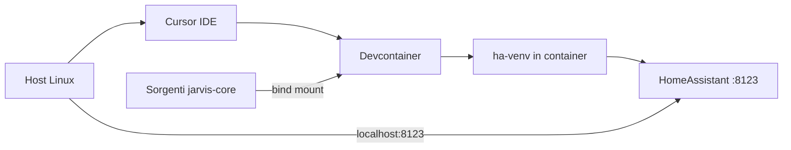

<!-- agents-memory v1 | project: jarvis-core | updated: 2026-07-08 | status: ARCHIVED -->

# DEV_ENVIRONMENT — jarvis-core

> **STORICO (repo archiviato 2026-07-08).** Per lo sviluppo attivo vedi `jarvis-monitor` (`scripts/setup`, `scripts/develop`, devcontainer in quel repo).
>
> Riassunto delle decisioni e della configurazione dell'ambiente di sviluppo **del fork**.
> Destinatari: colleghi e agenti AI che consultano questo repo in sola lettura.

## Scopo

`jarvis-core` è un fork di **Home Assistant Core** orientato al monitoring evoluto multi-bus (KNX, Lutron, DALI). Questo documento descrive **come sviluppare sul progetto**: scelte architetturali, setup del devcontainer, verifiche effettuate e problemi noti.

Per decisioni di prodotto e implementazione monitoring, vedi [`MONITORING_PLAN.md`](MONITORING_PLAN.md) e [`DECISIONS.md`](DECISIONS.md).

---

## Decisioni prese

| Decisione | Scelta | Motivazione |
|-----------|--------|-------------|
| Modello di sviluppo | **Devcontainer** (Cursor / VS Code) | Percorso ufficiale per HA Core; ambiente riproducibile con sorgenti montati dal host |
| Alternative valutate | Setup locale puro; `Dockerfile` produzione con mount manuale | Locale ok su Linux ma meno riproducibile; il `Dockerfile` di produzione non è pensato per il ciclo dev |
| IDE | **Cursor** con estensione **Dev Containers** | Compatibile con [`.devcontainer/devcontainer.json`](../../.devcontainer/devcontainer.json) esistente |
| Config HA locale | Cartella [`config/`](../../config/) nel repo | Creata automaticamente da `script/setup` |
| Virtualenv | Dentro il container (`/home/vscode/.local/ha-venv`) | Non usare `.venv` sul host quando si lavora col devcontainer |

---

## Architettura del flusso di sviluppo



### Punti chiave

- I sorgenti restano su `/home/neven/dev/jarvis-core` sul disco del host: **non si perdono** se il container viene ricreato.
- Il venv Python vive **dentro** il container (`/home/vscode/.local/ha-venv`), non in `.venv` sul host.
- Porte esposte dal devcontainer:
  - `8123` — interfaccia web Home Assistant
  - `5683/udp` — integrazione Shelly
- Su Linux è possibile esporre hardware (USB, Bluetooth, Zigbee) al container; su Windows/macOS è più limitato.

---

## File di configurazione rilevanti

| File | Ruolo |
|------|-------|
| [`.devcontainer/devcontainer.json`](../../.devcontainer/devcontainer.json) | Definizione container: porte, mount SSH, feature Node LTS, estensioni VS Code |
| [`Dockerfile.dev`](../../Dockerfile.dev) | Immagine dev: Python via `uv`, dipendenze di sistema (`ffmpeg`, `bluez`, ecc.) |
| [`.vscode/tasks.json`](../../.vscode/tasks.json) | Task IDE: `Run Home Assistant Core`, pytest, ruff, prek |
| [`script/setup`](../../script/setup) | Setup iniziale: venv, pre-commit, config HA (eseguito in `postCreateCommand`) |
| [`script/bootstrap`](../../script/bootstrap) | Aggiorna dipendenze e traduzioni (eseguito in `postStartCommand`) |
| [`config/configuration.yaml`](../../config/configuration.yaml) | Configurazione HA locale di sviluppo |

### Configurazione attuale del devcontainer

Il file `devcontainer.json` include:

- `postCreateCommand`: `git config --global --add safe.directory` + `script/setup`
- `postStartCommand`: `script/bootstrap`
- Feature **GitHub CLI** e **Node LTS** (per build frontend `jarvis_monitor`)
- Mount `~/.ssh` del host → `/home/vscode/.ssh` (per Git push via SSH)
- Porte `8123:8123` e `5683:5683/udp`

---

## Guida operativa

### Prerequisiti sul host

- Docker (testato: 29.6.1)
- Cursor (o VS Code)
- Estensione **Dev Containers** (`ms-vscode-remote.remote-containers`)

### Setup iniziale (passo-passo)

1. Aprire `/home/neven/dev/jarvis-core` in Cursor
2. Installare l'estensione **Dev Containers** se non presente
3. `Ctrl+Shift+P` → **Dev Containers: Reopen in Container**
4. Attendere il build dell'immagine (5–15 minuti la prima volta)
5. Verificare che `postCreateCommand` (`script/setup`) e `postStartCommand` (`script/bootstrap`) siano completati senza errori
6. In basso a sinistra deve comparire **"Dev Container: Home Assistant Dev"**

### Avvio di Home Assistant

**Metodo A — Task IDE (consigliato):**

1. `Ctrl+Shift+P` → **Tasks: Run Task**
2. Selezionare **Run Home Assistant Core**

**Metodo B — Terminale nel container:**

```bash
python -m homeassistant -c config
```

Aprire nel browser: **http://localhost:8123**

### Verifica ambiente

```bash
python --version                    # atteso: Python 3.14.x
which python                        # atteso: /home/vscode/.local/ha-venv/bin/python
python -m homeassistant --version   # atteso: 2026.8.0.dev0 (o successivo)
```

### Comandi utili

```bash
uv run pytest                       # eseguire i test
uv run prek run --all-files         # lint e format
script/server                       # avvia HA (alternativa al task)
```

### Build frontend monitoring (quando serve)

```bash
cd homeassistant/components/jarvis_monitor/frontend
npm install && npm run build
```

Richiede Node LTS nel devcontainer (già configurato). Dopo modifiche a `devcontainer.json`: **Dev Containers: Rebuild Container**.

### Flusso di lavoro quotidiano

| Azione | Come |
|--------|------|
| Aprire il progetto | Cursor si riconnette automaticamente al devcontainer |
| Modificare codice | File sul host, visibili nel container via bind mount |
| Riavviare HA dopo modifiche | `Ctrl+C` nel terminale, poi rilanciare il task o `python -m homeassistant -c config` |
| Eseguire test | Task **Pytest** o `uv run pytest` |
| Lint/format | Task **Ruff** o **Prek** |
| Debug | `F5` (debugger integrato nel devcontainer) |

---

## Stato verificato (6 luglio 2026)

Verifica automatica eseguita dopo il primo setup del devcontainer:

| Controllo | Esito |
|-----------|-------|
| Docker installato | Sì — versione 29.6.1 |
| Devcontainer creato | Sì — immagine buildata con successo |
| `script/setup` completato | Sì — cartella `config/` creata con `configuration.yaml` |
| Python nel container | 3.14.5 (`/home/vscode/.local/ha-venv/bin/python`) |
| Home Assistant installato | Sì — `2026.8.0.dev0` |
| Avvio HA | HTTP 302 su `localhost:8123` (redirect alla schermata di setup) |
| Cursor connesso al container | No al momento della verifica (sessione sul host) |

**Conclusione:** il setup del devcontainer è completo e funzionante. Per lavorare serve riconnettersi al container e avviare HA.

---

## Modifiche al devcontainer dopo il setup iniziale

| Data | Modifica | File | Azione richiesta |
|------|----------|------|------------------|
| 2026-07-07 | Node LTS per build frontend `jarvis_monitor` e prettier | `.devcontainer/devcontainer.json` — feature `node:1` | **Rebuild Container** |
| 2026-07-08 | Mount `~/.ssh` host → `/home/vscode/.ssh` per Git push | `.devcontainer/devcontainer.json` — `mounts` | **Rebuild Container** |

Commit di riferimento: `f7b390246af` — *Add Node LTS to the dev container for frontend builds.*

---

## Problemi noti e workaround

### Git push dal container

**Problema:** push Git da shell non interattiva (es. agente AI) può fallire.

**Cause individuate (8 luglio 2026):**

- Il bridge credenziali VS Code Dev Containers non è disponibile nella shell dell'agente (`REMOTE_CONTAINERS_IPC` non impostato; socket IPC stale)
- `SSH_AUTH_SOCK` inoltrato da Cursor, ma `ssh-add -l` restituisce *The agent has no identities*
- Chiavi SSH create **dentro** un container precedente sono andate perse (home del container effimera)
- `gh auth status` → non loggato nel container

**Soluzioni:**

1. **Mount `~/.ssh`** — già configurato in `devcontainer.json`; dopo rebuild le chiavi del host sono disponibili nel container
2. **Push da terminale integrato Cursor** — usa il bridge credenziali dell'IDE
3. **`gh auth login`** nel container — alternativa per autenticazione GitHub CLI
4. Non creare chiavi SSH dentro il container: usarle dal host tramite mount

### Alternative scartate per lo sviluppo

| Approccio | Perché non usato |
|-----------|------------------|
| `Dockerfile` produzione + mount manuale | Nessun workflow ufficiale; debug e test scomodi; rebuild lenti |
| Solo setup locale senza container | Meno riproducibile tra colleghi; dipendenze di sistema da gestire manualmente |

---

## Troubleshooting rapido

| Sintomo | Soluzione |
|---------|-----------|
| Build lento la prima volta | Normale (5–15 min). Le volte successive il container parte in pochi secondi |
| Porta 8123 occupata | Fermare l'altro processo, oppure cambiare `appPort` in `devcontainer.json` (es. `"8124:8123"`) |
| `postCreateCommand` fallito | Aprire terminale nel container e rilanciare `script/setup` |
| Errore permessi Docker | Aggiungere l'utente al gruppo `docker`: `sudo usermod -aG docker $USER`, poi logout/login |
| Modifiche a `devcontainer.json` non applicate | **Dev Containers: Rebuild Container** |
| `.venv` assente sul host | Atteso quando si usa il devcontainer; il venv è nel container |
| HA non risponde su localhost:8123 | Verificare di essere nel container e che HA sia avviato; controllare `docker ps` per le porte |

---

## Confronto approcci di sviluppo

| Approccio | Sorgenti | Ambiente | Ideale per |
|-----------|----------|----------|------------|
| **Devcontainer** | Host (montati) | Container | Sviluppo quotidiano (scelta adottata) |
| **Locale (`script/setup`)** | Host | Host | Linux, massima velocità su test/lint |
| **Dockerfile produzione** | Mount manuale | Container | Deploy, non sviluppo |

---

## Istruzioni per agenti AI

Se il task riguarda setup, devcontainer, avvio HA locale o tooling di sviluppo:

1. **Leggi questo file** per intero
2. Esegui **SYNC** su:
   - [`PROJECT_STATE.md`](PROJECT_STATE.md) — stack, DB, comandi avvio
   - [`WORKLOG.md`](WORKLOG.md) — prime 3 voci per aggiornamenti recenti
3. Se il task riguarda **monitoring / jarvis_monitor**: leggi [`MONITORING_PLAN.md`](MONITORING_PLAN.md)
4. Dopo modifiche a `.devcontainer/devcontainer.json`: ricordare all'utente **Rebuild Container**
5. Non assumere che `.venv` esista sul host; nel devcontainer usare `/home/vscode/.local/ha-venv/bin/python`
6. Per push Git: preferire terminale integrato Cursor o verificare mount SSH; la shell non interattiva dell'agente può non avere credenziali

---

## Riferimenti incrociati

| File | Contenuto |
|------|-----------|
| [`PROJECT_STATE.md`](PROJECT_STATE.md) | Stack, DB, comandi avvio, test |
| [`DECISIONS.md`](DECISIONS.md) | ADR prodotto (monitoring) |
| [`MONITORING_PLAN.md`](MONITORING_PLAN.md) | Piano implementazione monitoring |
| [`WORKLOG.md`](WORKLOG.md) | Storico modifiche e diagnosi |
| [`../README.md`](../README.md) | Indice memoria condivisa |
| [`../../docs/HomeAssistant/01_getting_started/development_environment.md`](../../docs/HomeAssistant/01_getting_started/development_environment.md) | Documentazione ufficiale HA Core |

---

**Ultimo aggiornamento:** 2026-07-08
**Branch:** `neven/jarvis`
**Progetto:** jarvis-core
